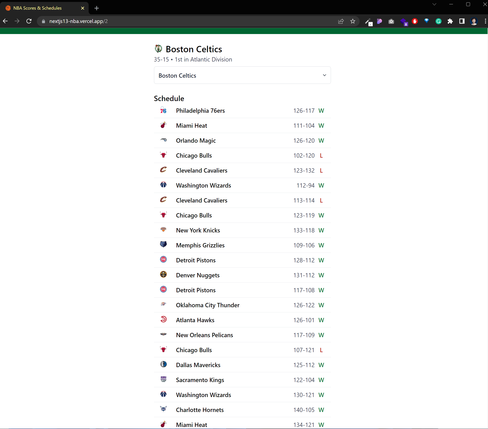
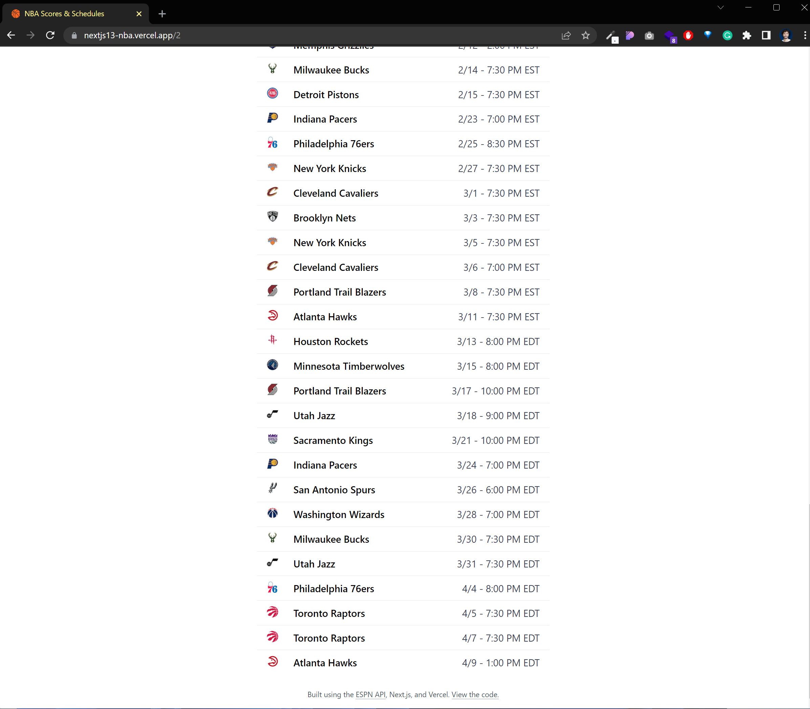
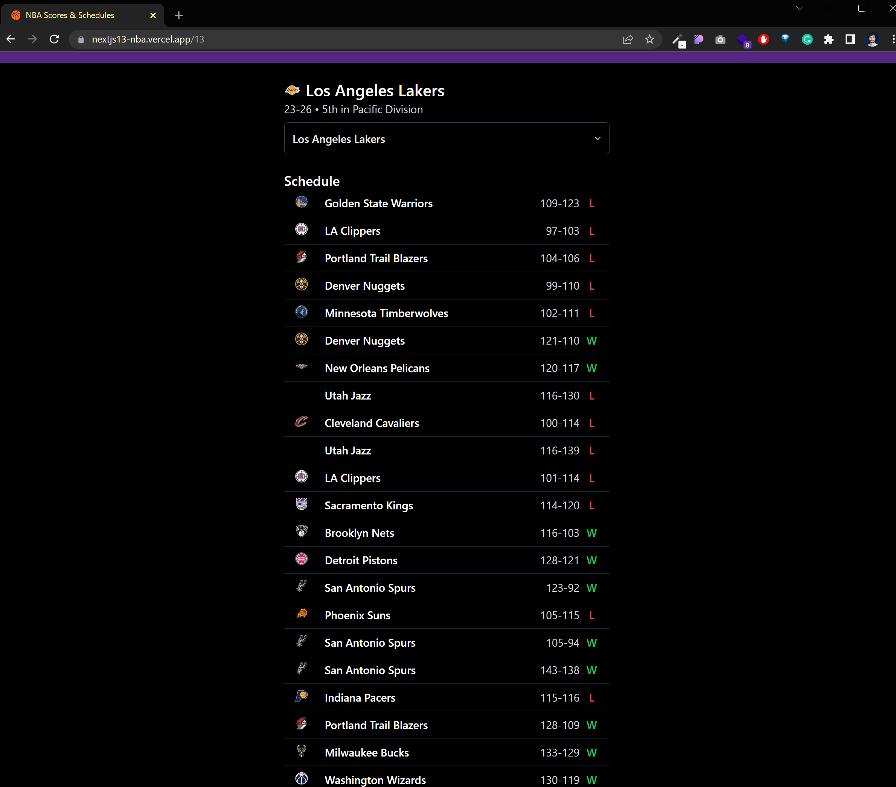
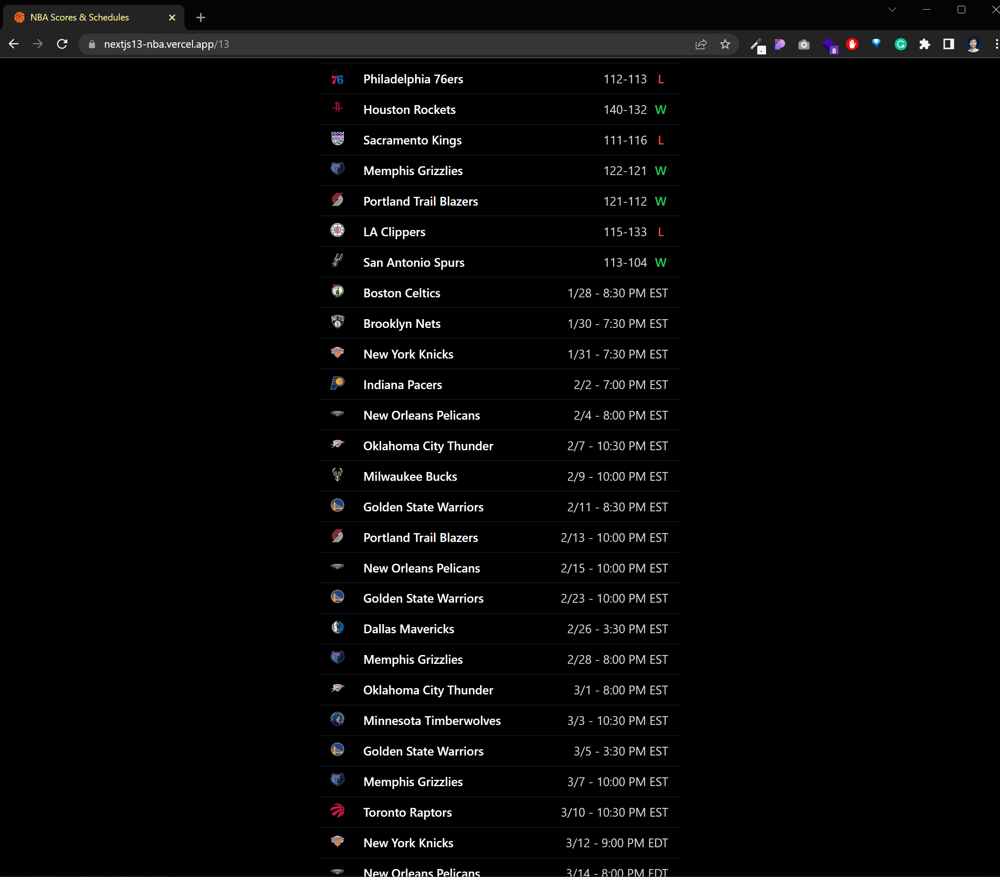
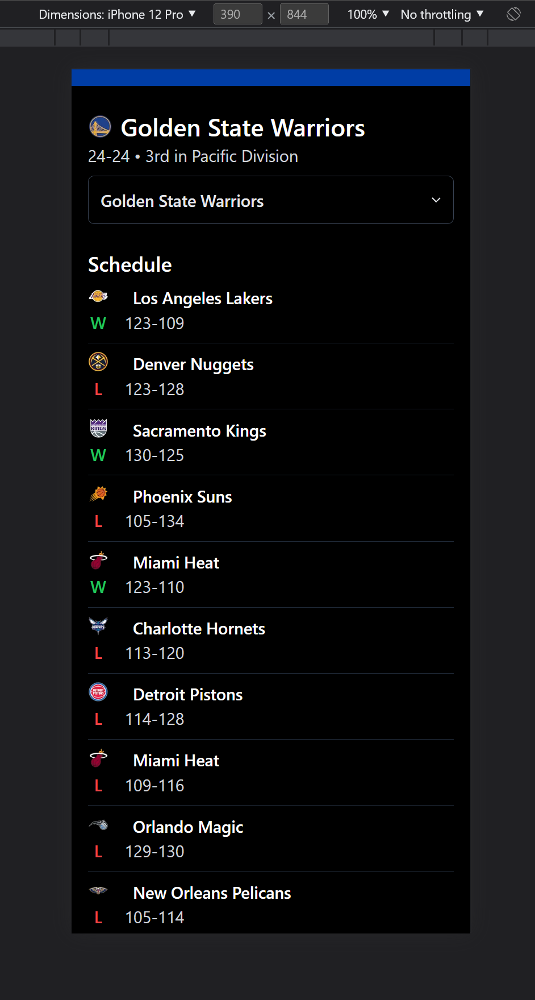
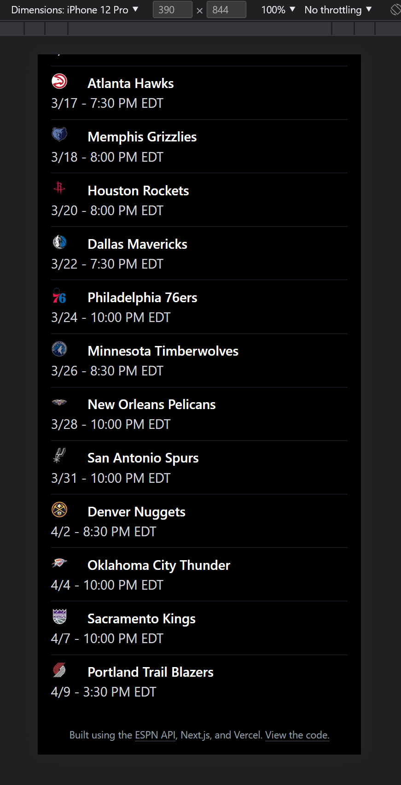
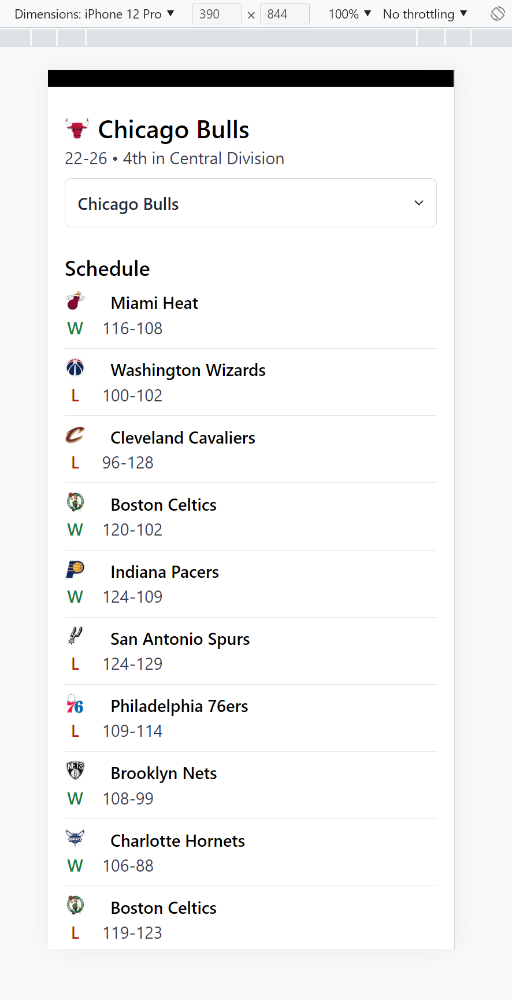
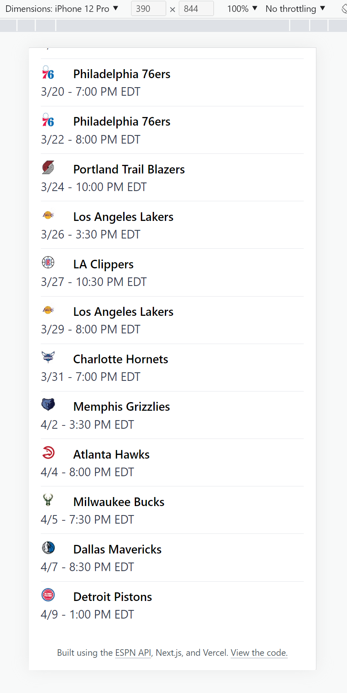

# NBA

> Simple basketball scores and schedules fetching from ESPN Api https://www.espn.com/apis/devcenter/io-docs.html

## 💻 Demonstration

<h5 align="center"> 🔗 Online: https://nextjs13-nba.vercel.app</h5>

 

  <h5 align="center">🖥 Desktop (Light Mode)</h5>
  <kbd>

</kbd>
  <kbd>

</kbd>

  <h5 align="center">🖥 Desktop (Dark Mode)</h5>
  <kbd>

</kbd>
  <kbd>

</kbd>

  <h5 align="center">📱 Mobile (Dark Mode)</h5>

  <kbd>

</kbd>
  <kbd>

</kbd>

<h5 align="center">📱 Mobile (Light Mode)</h5>

  <kbd>

</kbd>
  <kbd>

</kbd>

 

## APIs

https://gist.github.com/akeaswaran/b48b02f1c94f873c6655e7129910fc3b

https://www.espn.com/apis/devcenter/io-docs.html

## Stack

This site using the following stack:

- Framework - [Next.js 13](https://nextjs.org/13)
- Language - [TypeScript](https://www.typescriptlang.org)
- Styling - [Tailwind CSS](https://tailwindcss.com)
- Analytics - [Vercel Analytics](https://vercel.com/analytics)
- Linting - [ESLint](https://eslint.org)
- Formatting - [Prettier](https://prettier.io)

## Notes:

This template uses the new `app` directory (beta) in Next.js 13. This includes support for enhanced layouts, colocation of components, tests, and styles, component-level data fetching, and more.
